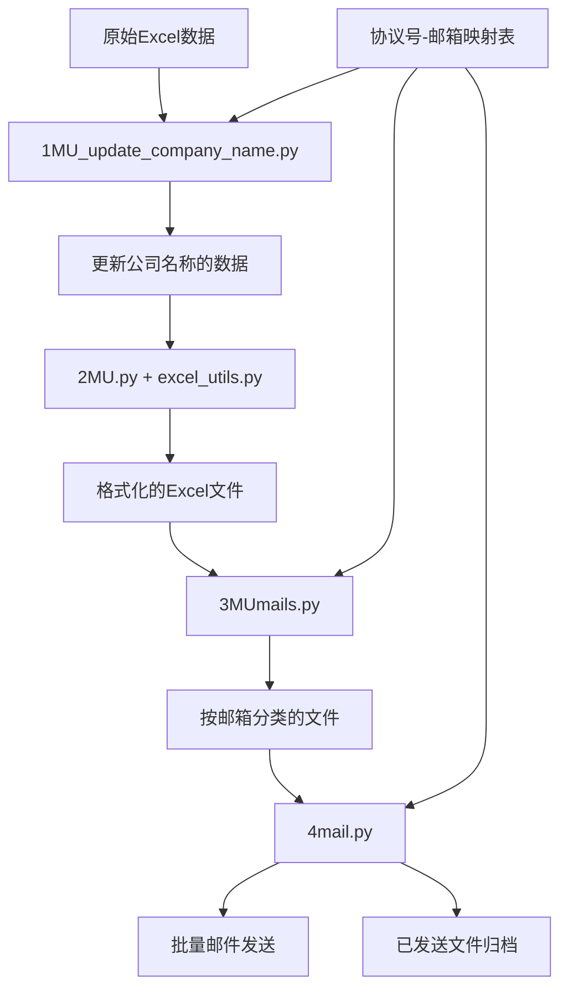

白名单邮件自动化系统

## 项目介绍 

这个项目是一个完整的白名单数据处理和邮件自动化发送系统，通过4个主要脚本和1个工具模块实现从原始数据处理到邮件批量发送的完整流程。适用于商旅TMC公司，自动化处理航司白名单待增补数据，并根据现有航司模板，自动生成单独的 `.xlsx` 文件，归类并发送邮件。

**请注意，本项目中的数据结构设计完全基于实际业务场景。由于航司的模板每年可能会有所变动，因此需要根据最新的模板内容进行相应的调整。此外，不同公司在待增补数据的字段上可能存在差异，这也需要根据各个公司的具体业务需求来进行定制化的修改！**

****

## 脚本架构图

```
原始数据 → 1MU_update_company_name.py → 2MU.py → 3MUmails.py → 4mail.py
   ↓              ↓                        ↓           ↓            ↓
 Excel原始      更新公司名称              格式化      文件分类     邮件发送
 白名单数据                              数据处理
   
                    excel_utils.py (工具模块)
                         ↑
                   提供数据处理功能
```

## 功能特点

- 自动更新公司名称信息
- 处理员工数据并格式化为标准格式
- 根据规则将文件分类到对应邮箱目录
- 批量发送邮件，支持抄送和自定义设置

## 示例数据格式 

### 1. 原始数据文件格式 (raw_data.xlsx) 

原始数据文件包含待处理的白名单数据，表头格式如下：

| 协议号 | 公司名称 | 姓名 | 身份证号码 | 证件类型 | 证件号码 | 其他信息...|
|------------------------|--------------------------|--------------|------------------------|----------------------|------------------------|------------------------------|
| MU001                  |                          | 张三          | 110101199001011234     | 身份证               |                        | ...                          |
| MU002                  | 某旅行社                 | 李四          |                        | 护照                 | E12345678              | ...                          |
| MU003                  |                          | 王五          | 310101199203033456     | 身份证               |                        | ...                          |

### 2. 联系人列表文件格式

联系人列表文件包含协议号与联系人的映射关系，表头格式如下：

| 协议号 | 协议客户名称 | 航司对接人邮箱 | 抄送邮箱 | 是否单独发送 |
|------------------------|---------------------------|----------------------------------------|----------------------|--------------------------------|
| MU001                  | 北京某旅行社                | contact1@example.com                   | cc1@example.com      |                                |
| MU002                  | 上海某旅行社                | contact2@example.com                   | cc2@example.com,cc3@example.com | 是                             |
| MU003                  | 广州某旅行社                | contact3@example.com                   |                      |                                |

### 3. 处理后的数据文件格式 **本项目以东航24年11月份白名单新增模板为例**

经过处理后，生成的Excel文件表头格式如下：

**第一行 | Row 1:** 

| 姓名信息(中英文至少填写一项） | | | 证件信息（至少填写一种证件） | | | | C0客户必填 | |
|-------------------------------|---|---|------------------------------|---|---|---|------------|---|

**第二行 | Row 2:**

| 员工姓名（中）| 员工姓名（英/拼音） | 生日<br>Birthday | 身份证号码| 护照号码 | 其他证件类型 | 其他证件号 | 所属企业名称 | 企业所在地|
|-------------------------------------------|-------------------------------------------------------|------------------|----------------------------|---------------------------|-------------------------------|----------------------------|---------------------------------|--------------------------------|
| 张三                                      | ZHANG SAN                                             | 1990-01-01       | 110101199001011234         |                           |                               |                            | 北京某旅行社                   | 北京                           |
| 李四                                      | LI SI                                                 | 1985-05-15       |                            | E12345678                 |                               |                            | 上海某旅行社                   | 上海                           |
| 王五                                      | WANG WU                                               | 1992-03-03       | 310101199203033456         |                            |                               |                            | 广州某旅行社                   | 广州                           |

为了使系统正常运行，需要一份本地xlsx文件作为储存需要发送给航司的所有对接人的信息邮箱。xlsx文件的具体表头格式应如下：

| 序号 | 协议客户名称  | 签署区域 | 协议号 | 客户经理/邮箱 | 航司对接人 | 航司对接人邮箱 | 抄送邮箱 | 是否单独发送 | 是否自动发送 | 备注 |
|------|--------------|----------|--------|---------------|------------|----------------|----------|--------------|--------------|------|
|      |              |          |        |               |            |                |          |              |              |      |

请按照上述表头格式准备Excel文件，并确保所有必填字段都已填写。

## 关于示例数据 

**重要说明**：本项目中包含的所有Excel文件和表头结构都是基于实际业务流程的模板，但已移除所有敏感信息和实际数据。这些模板文件仅作为参考，展示数据结构和格式。在实际使用时，请替换为您自己的数据文件，并确保它们遵循相同的表头结构。

## 项目结构 

```
.
├── src/                    # 源代码目录 | Source code directory
│   ├── update_company.py   # 更新公司名称脚本 | Company name update script
│   ├── process_data.py     # 数据处理脚本 | Data processing script
│   ├── organize_files.py   # 文件整理脚本 | File organization script
│   ├── send_emails.py      # 邮件发送脚本 | Email sending script
│   └── utils/              # 工具函数 | Utility functions
├── data/                   # 示例数据目录 | Sample data directory
│   ├── sample_data.xlsx    # 示例数据文件 | Sample data file
├── LICENSE                 # 许可证文件 | License file
└── README.md               # 项目说明文件 | Project description file
```

## 详细脚本功能说明 

### 1. `1MU_update_company_name.py` - 公司名称更新器

**功能 / Function:**
- 根据协议号映射关系更新原始数据中的公司名称
- 将标准化的公司名称替换到原始白名单数据中
- 这个功能实际是替换公司中系统登记文本与要发送的内容不一致，如果系统数据一致，可直接忽略

**输入文件 / Input Files:**
- `RawData.xlsx` - 原始白名单数据
- `邮件批量发送/MU批量发送列表.xlsx` - 协议号与标准公司名称映射表

**输出文件 / Output Files:**
- `RawData/MUwhitelist_updated.xlsx` - 更新公司名称后的数据

**核心逻辑 / Core Logic:**
```python
# 建立协议号到公司名称的映射关系
protocol_mapping = dict(zip(contact_list_df['协议号'], contact_list_df['协议客户名称']))
# 替换公司名称
rawdata_df['公司名称'] = rawdata_df['协议号'].map(protocol_mapping).combine_first(rawdata_df['公司名称'])
```

**数据流 / Data Flow:**
```
原始Excel → 读取映射关系 → 替换公司名称 → 保存更新后的文件
```

---

### 2. `2MU.py` - 数据格式化处理器

**功能 / Function:**
- 将更新后的数据格式化为航司要求的白名单标准格式
- 按协议号拆分为独立的Excel文件
- 设置专业的Excel样式和格式（字体样式、字号大小、列宽行高、单元格&字体颜色等）

**依赖模块 / Dependencies:**
- `excel_utils.py` - 提供数据处理核心功能

**输入文件 / Input Files:**
- `RawData/MUwhitelist_updated.xlsx` - 第1步输出的更新数据

**输出文件 / Output Files:**
- `output/MU协议号拆分.xlsx` - 按协议号分工作表的汇总文件
- `output/MU_[协议号]_[公司名称].xlsx` - 按协议号拆分的独立文件

**核心数据处理流程 / Core Processing Pipeline:**

1. **生日提取** (`extract_birthday_and_add_to_column`)
   - 从身份证号中提取生日信息
   - 支持18位身份证号 

2. **信息拆分** (`split_info_to_next_row`) 
   - 将包含多个证件信息的行拆分为独立行

3. **列拆分** (`split_column_and_add`)
   - 将证件信息列拆分为证件类型和证件号码

4. **拼音转换** (`convert_names_to_pinyin`)
   - 将中文姓名转换为拼音格式
   - 分离姓氏和名字

5. **按协议号分组保存** (`save_grouped_to_sheets`)
   - 将数据按协议号分组保存到不同工作表

6. **Excel格式优化** (`modify_sheets`)
   - 设置标准的白名单表格格式
   - 添加表头、设置字体、颜色填充
   - 合并单元格、设置列宽行高

7. **文件拆分** (`split_sheets_to_individual_files`)
   - 将每个工作表保存为独立的Excel文件
   - 删除不需要的列，优化文件结构

### 3. `excel_utils.py` - 数据处理工具模块

**功能**
- 为主处理脚本提供核心数据处理功能
- 封装可复用的Excel操作和数据转换函数

**核心函数说明**

#### `extract_birthday_and_add_to_column(df, id_col='证件信息', birthday_col='员工生日')`
- **功能**: 从身份证号提取生日信息
- **输入**: DataFrame, 身份证列名, 生日列名
- **逻辑**: 
  - 解析18位身份证: 位置6-13为出生日期YYYYMMDD
  - 格式化现有生日数据

#### `split_info_to_next_row(df, col='证件信息')`
- **功能**: 拆分包含多个信息的单元格到多行
- **场景**: 当一个人有多个证件信息时，每个证件占一行

#### `split_column_and_add(df, col='证件信息', new_col='证件类型')`
- **功能**: 将证件信息列按分隔符拆分为证件类型和证件号码
- **格式**: "身份证|1234567890" → 证件类型:"身份证", 证件号码:"1234567890" （这里的"|"主要是由于实际业务场景，请根据业务场景进行替换）

#### `convert_names_to_pinyin(df, name_col='姓名', surname_col='姓', givenname_col='名')`
- **功能**: 中文姓名转拼音并分离姓氏和名字
- **依赖**: pypinyin库
- **示例**: "张三" → 姓:"ZHANG", 名:"SAN"

#### `save_grouped_to_sheets(df, save_path, file_name, company_name_col, agreement_col)`
- **功能**: 按协议号分组保存到不同工作表
- **特性**: 
  - 自动创建工作表
  - 处理工作表名称长度限制(31字符)
  - 清理无效字符

---

### 4. `3MUmails.py` - 文件分类器

**功能**
- 根据协议号和邮箱映射关系，将处理后的Excel文件分类到对应邮箱文件夹
- 为批量邮件发送做准备

**输入数据**
- `邮件批量发送/MU批量发送列表.xlsx` - 协议号与邮箱映射关系
- `output/` 目录中的所有 `MU_*.xlsx` 文件

**输出结构**
```
target/
├── user1@company.com/
│   ├── MU_001_公司A.xlsx
│   └── MU_002_公司B.xlsx
├── user2@company.com/
│   ├── MU_003_公司C.xlsx
│   └── MU_004_公司D.xlsx
└── ...
```

**核心逻辑**
1. 读取协议号到邮箱的映射关系
2. 遍历output目录中的Excel文件
3. 从文件名提取协议号 (格式: `MU_协议号_公司名.xlsx`)
4. 根据映射关系找到对应邮箱
5. 创建邮箱目录并移动文件

**错误处理**
- 验证邮箱地址有效性
- 处理文件名格式不正确的情况
- 处理映射关系缺失的情况

---

### 5. `4mail.py` - 批量邮件发送器

**功能**
- 验证邮箱与文件的匹配关系
- 批量发送带附件的邮件
- 支持抄送、单独发送等高级功能

**核心功能模块**

#### `verify_email_agreement_match(excel_path, target_dir)`
- **功能**: 验证邮箱配置与实际文件的一致性
- **验证项**:
  - 邮箱格式正确性
  - 文件夹是否存在
  - 协议号文件是否匹配
  - 抄送邮箱格式验证

#### `send_customized_emails(smtp_host, smtp_port, sender, password, validation_results, target_dir, test_mode, delay_seconds)`
- **功能**: 发送定制化邮件
- **特性**:
  - 支持测试模式(不实际发送)
  - 可配置发送延迟
  - 自动生成邮件主题和正文
  - 支持HTML格式邮件
  - 批量附件处理

#### 邮件内容生成逻辑

**主题格式**
- 单个附件: `[文件名]_白名单新增`
- 多个附件: `[航司代码]_白名单新增_[数量]家`

**正文模板**
```
经理，您好

附件为本期白名单新增，烦请录入，谢谢！
[附件文件名列表]

祝好。

[个人签名信息]
```

#### `move_sent_folders(folders, target_dir)`
- **功能**: 将已成功发送的文件夹移动到"已批量发送"目录
- **目的**: 避免重复发送，保持目录整洁

**高级功能**

1. **邮件分组策略**:
   - 按抄送列表分组
   - 支持单独发送模式
   - 相同收件人+抄送的合并发送

2. **发送控制**:
   - 可配置发送间隔(防止服务器限制)
   - 失败重试机制
   - 详细的发送日志

3. **预览功能**:
   - 发送前预览所有邮件内容
   - 验证附件列表和收件人信息
   - 用户确认机制

---

## 数据流转图



## 配置文件说明

### `邮件批量发送/MU批量发送列表.xlsx`
**用途**: 核心配置文件，被多个脚本使用

**必需列**
- `协议号` - 唯一标识符
- `协议客户名称` - 标准公司名称  
- `航司对接人邮箱` - 主收件人
- `抄送邮箱` - 抄送收件人(可选)
- `是否单独发送` - 控制发送策略(可选)

## 使用方法 

### 安装依赖 

```bash
pip install -r requirements.txt
```

## 使用流程

### 步骤1: 数据准备
```bash
# 放置原始数据文件
RawData/rawdata.xlsx
邮件批量发送/MU批量发送列表.xlsx
```

### 步骤2: 执行处理流程
```bash
# 1. 更新公司名称
python 1MU_update_company_name.py

# 2. 格式化数据
python 2MU.py

# 3. 文件分类
python 3MUmails.py

# 4. 邮件发送(先测试)
python 4mail.py --test

# 5. 正式发送
python 4mail.py --delay 3
```

### 步骤3: 结果验证
- 检查 `target/` 目录下的文件分类
- 验证邮件发送日志
- 确认 `已批量发送/` 目录中的归档文件

## 错误处理和日志

### 常见错误类型
1. **文件路径错误** - 检查配置路径是否正确
2. **邮箱格式错误** - 自动验证并跳过无效邮箱
3. **协议号不匹配** - 详细日志显示匹配状态
4. **SMTP连接失败** - 检查邮件服务器配置
5. **文件权限问题** - 确保有读写权限

### 日志级别
- **INFO** - 正常处理进度
- **WARNING** - 数据质量问题
- **ERROR** - 处理失败
- **DEBUG** - 详细调试信息

## 性能优化建议

1. **批量处理**: 避免逐行处理大型Excel文件
2. **内存管理**: 大文件分块处理
3. **并发控制**: 邮件发送使用合适的延迟
4. **缓存机制**: 重复使用映射关系数据
5. **错误恢复**: 支持从中断点继续处理

## 扩展性设计

1. **模块化架构**: 每个脚本职责单一，易于维护
2. **配置驱动**: 通过Excel配置文件控制行为
3. **插件机制**: excel_utils.py提供可扩展的处理函数
4. **标准接口**: 统一的输入输出格式
5. **测试支持**: 内置测试模式和验证机制 

## 许可证 

MIT

## 贡献 

由于我是文科专业背景且自学python，代码逻辑可能会包含些许逻辑错误和运行问题，欢迎提交问题和贡献代码！
